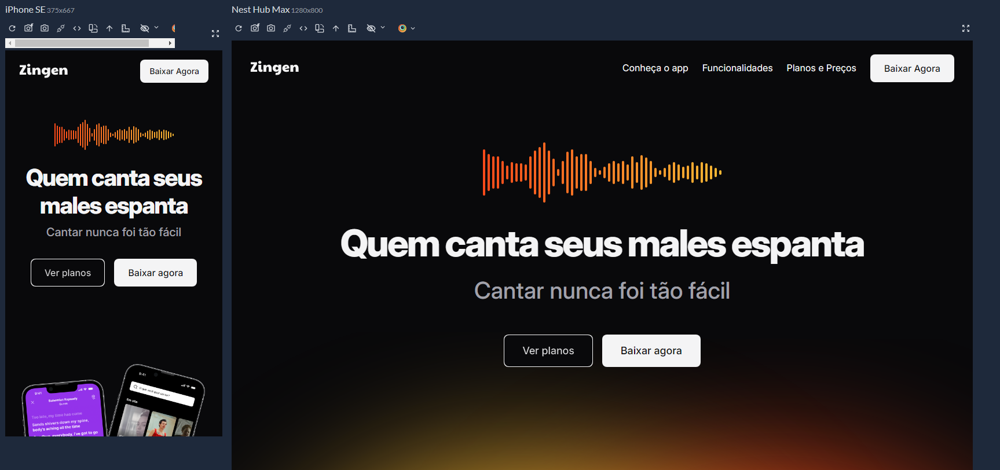

Programa Full Stack Rocketseat

# Projeto Zingen  - Karaokê - Responsividade

O projeto foi desenvolvido durante os modulos de Responsividade dentro da trilha full stack do programa da Rocketseat. Foram utilizadas Classes Utilitarias em css, estrategias de mobile first, html semantico, reutilização de variaveis em Css, uso de grid, uso de linear-gradient que gera o fundo degrade das cores

 

##  Tecnologias usadas no projeto

## Link da aplicação

👉🏼[Clique aqui para accessar](https://zinger-responsividade.netlify.app/)

## Layout
👉🏼[Figma da aplicação](https://www.figma.com/design/B5HYFlmennWAp14cPsqoXB/LP-de-produto-(Community)?node-id=0-1&node-type=canvas&t=NoidN4MHqYOErnyd-0)

## 🔗 Deploy 

## 💻 Sobre mim 😄
 Estudante de Engenharia de Software na UNOPAR e 
 Desenvolvedor Front End estudando na Rocketseat dentro do Programa Full Stack 

## 🔗 Contato 

